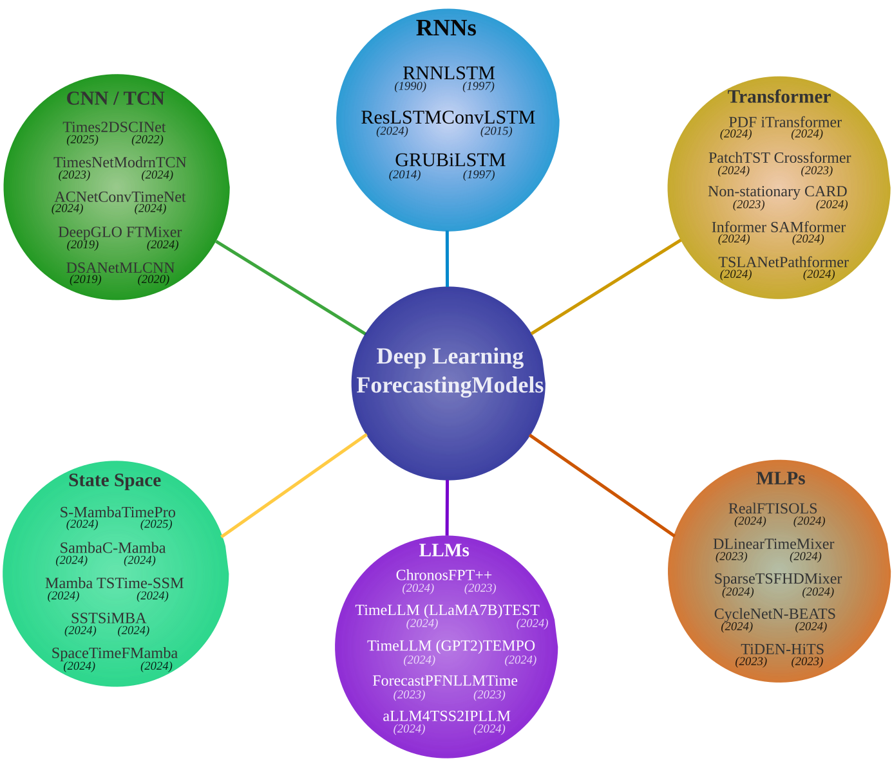

<p align="center">
  
</p>

<details>
<summary><strong>Overview</strong></summary>

This repository provides a unified benchmarking framework for residential load forecasting using state-of-the-art deep learning models, including:

- Conventional forecasting models and Large Language Models (LLMs)
- Four residential electricity datasets
- Multiple forecasting horizons
- Multiple input sequence lengths
- Accuracy benchmarking using MAE and RMSE
- Computational efficiency evaluation

Since LLM-based approaches require additional dependencies and computational resources, they are separated from conventional models so users can install only the packages required for their experiments.

<details>
<summary><strong>Conventional Models (<code>Conventional_Models/</code>)</strong></summary>

- Recurrent Neural Networks (RNNs)
- CNN / TCN Models
- Transformer Models
- MLP / Linear Models
- State Space Models (SSMs)

</details>

<details>
<summary><strong>Large Language Models (<code>LLMs/</code>)</strong></summary>

- TimeLLM-GPT2 (GPT-2-based LLM)
- TimeLLM-LLaMA7B (LLaMA-7B-based LLM)
- TEMPO (GPT-2-based LLM with LoRA fine-tuning)

</details>

</details>

---

<details>
<summary><strong>How to Use This Repository</strong></summary>

### Prerequisites

All experiments were developed and tested using **Python 3.10**.

### 1. Clone the Repository

#### Conventional Models (Non-LLMs)

```bash
git clone https://github.com/Tims2D/Residential-Load-Forecasting-Benchmark.git
cd Residential-Load-Forecasting-Benchmark/Conventional_Models
```

#### LLM-Based Models

```bash
git clone https://github.com/Tims2D/Residential-Load-Forecasting-Benchmark.git
cd Residential-Load-Forecasting-Benchmark/LLMs
```

### 2. Install Dependencies

#### Conventional Models (Non-LLMs)

```bash
pip install -r requirements.txt
```

#### LLM-Based Models

```bash
pip install -r requirements_llm.txt
```

### 3. Prepare Your Dataset

Place your dataset inside the `dataset/` directory.

#### Dataset Requirements

- Dataset must be in CSV format.
- The target variable must be the last column.
- All preceding columns are treated as input features.

### 4. Run a Model

Example:

```bash
sh ./scripts/lstm/lstm_15Minute_data.sh
```

You can run other models using their corresponding scripts.

</details>

---

<details>
<summary><strong>Repository Structure</strong></summary>

```text
Conventional_Models/
├── data_provider/
├── dataset/
├── exp/
├── layers/
├── models/
├── scripts/
└── utils/

LLMs/
├── data_provider/
├── dataset/
├── exp/
├── layers/
├── models/
├── scripts/
└── utils/
```

### `dataset/`

Contains benchmark datasets and user-provided datasets.

### `data_provider/`

Contains the data handling and preprocessing pipeline:

- Dataset loading
- Train/validation/test splitting
- Data normalization
- Forecast window generation
- PyTorch dataloader creation
- Temporal feature processing

### `exp/`

Contains experiment pipelines:

- Model initialization
- Training
- Validation
- Testing
- Checkpoint management
- Evaluation metrics
- Forecast generation
- Computational efficiency evaluation

### `models/`

Contains implementations of all forecasting models used in the benchmark.

### `layers/`

Contains reusable neural network building blocks:

- Attention layers
- Embedding layers
- Convolutional blocks
- Decomposition modules
- Transformer layers
- State-space components

### `utils/`

Contains utility functions:

- Evaluation metrics
- Visualization utilities
- Logging
- Early stopping
- Learning-rate scheduling

### `scripts/`

Contains ready-to-run shell scripts for benchmark experiments.

Example:

```bash
sh ./scripts/timemixer/timemixer_15Minute_data.sh
```

### `results/`

- `logs/` : Training and evaluation log files.
- `results/` : Saved forecasting outputs, including ground-truth and predicted values.
- `test_results/` : Visualization results generated during testing, such as forecast plots and comparison figures.

</details>

---

<details>
<summary><strong>Contribution</strong></summary>

We welcome contributions that improve this repository, including:

- Implementing new forecasting models
- Improving computational efficiency
- Adding new benchmark datasets
- Enhancing documentation
- Reporting bugs and issues
- Improving reproducibility and experimental consistency

Please ensure that all contributions follow the existing repository structure, coding style, and documentation guidelines.

</details>

---

<details>
<summary><strong>Contact</strong></summary>

For questions, suggestions, or collaboration opportunities, please contact:

**Reza Nematirad**  
📧 rezanematirad@gmail.com

</details>

---

<details>
<summary><strong>Acknowledgments</strong></summary>

We sincerely appreciate the following open-source projects for providing valuable codebases, implementations, and datasets that contributed to this work:

- https://github.com/vivva/DLinear
- https://github.com/zhouhaoyi/Informer2020
- https://github.com/luodhhh/ModernTCN
- https://github.com/yuqinie98/PatchTST
- https://github.com/VEWOXIC/FITS
- https://github.com/lss-1138/SparseTSF
- https://github.com/kwuking/TimeMixer
- https://github.com/thuml/Time-Series-Library
- https://github.com/thuml/iTransformer

We thank the authors and contributors of these repositories for making their implementations publicly available and supporting reproducible research in time-series forecasting.

</details>
